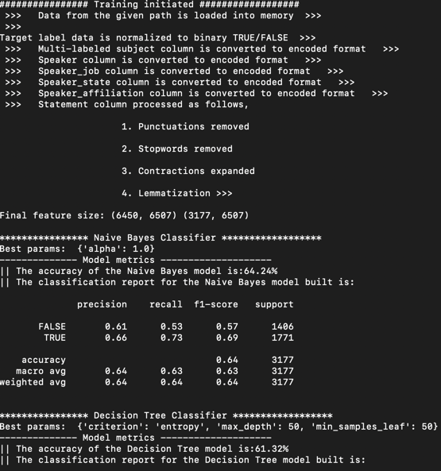

# Truthfulness Predictor
### Installation guide

Create a seperate environment just in case to avoid any conflicts with other packages already installed in your system

##### Steps to create a seperate conda environment
The below command creates a new environment with python3.10 installed in it. 
Feel free to change the "env_name" to any custom name of your choice

>conda create -n env_name python=3.10

Activate the environment by executing the following command

> conda activate env_name

##### pip installation of the python package

1. Open the folder containing the python package

2. Go to terminal/command prompt and run the following code
    > pip install dist/TruthPredict-0.1-py3-none-any.whl
   
3. The above code will install all the dependencies and install the entire package and its backend code in your system

### Project structure

Below is the overall project structure under the folder name Satalia-THT(Satalia Take Home Task)
```bash

Satalia-THT
   ├── build
   ├── dist
   ├── TruthPredict
   ├── README.md
   └── setup.py
   └── requirements.txt
```

- build        :  contains the os specific build files and libraries
- dist         :  contains distribution and wheel files for python package built 
- TruthPredict :  core package module developed 
- README.md    :  file with instructions and guidance to use the module
- setup.py     :  file that contains commands to build the python package
- requirements :  contains all the python package dependencies required for the module

The package "TruthPredict" is structured in the following way 

```bash
TruthPredict
├── __init__.py
├── constants.py
├── DataPreparation.py
├── Predictor.py
```

- constants.py : contains all the constant literal values and also the variable names which does not need to be changed
- DataPreparation.py : class "DataPrep" that cleans, formatts and encodes the given input data, ready for building model
- Predictor.py : contains the class "TruthClassifier" which builds model and predicts the truthfullness of the given test statement 

### Sample execution

The installation guide above has reached till the point of setting up environment and having this python package installed.
Now below we will see, how to run the package with some example codes

> from TruthPredict.Predictor import TruthClassifier
> classifier = TruthClassifier()

The above code has imported the TruthClassifier class from the package TruthPredict
"classifier" is the object created from the class.

>classifier.train_val_run(file_path={user_path}/data.csv',
                              grid_search_verbose=False,model_save_path='{path to save the build models}')

"train_val_run" method will trigger the training process. First the "DataPrep" class is executed to format and pre-process the data ready
for building the model.

>

The above image clearly shows the status commands getting printed while the train process is triggered.
Once all the pre-processing steps are completed, the model building stage is started and the for each algorithm, grid search 
is ran and the best parameters are used to build the model. All the necessary models, are stored in the specified location passed through the parameter "model_save_path" 

#### Sample test execution

A sample execution with code is shown below for inference,

> test_input = {'statement': 'The city of Clarkston cant decriminalize marijuana. Only state legislators and Congress can do that.', 'subjects': 'drugs', 'speaker_name': 'vernon-keenan', 'speaker_job': 'Director of the Georgia Bureau of Investigation', 'speaker_state': 'Georgia', 'speaker_affiliation': 'none', 'statement_context': 'Newspaper interview '}

A random input shown above, from the test file is chosen to show this demonstration of inference with the package.

> classifier.inference(json_input,model_path={model path given while training}')

This code will pass the given input, pre-process and encode them. The best model based on the accuracy is chosen to do the prediction. 
The predicted output is then saved under the class variable "prediction" and a reasoning is generated using feature importance values
and stored under class variable called "prediction_reason"